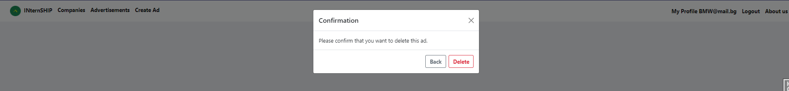

# Internship
 * A platform for offering internship programs

TECHNOLOGIES:

    - Django Framework
    - PostgreSQL
    - HTML5
    - CSS
    - Pillow
    - Bootstrap5
    - Django-crispy-forms
    - Django-summernote

#The web app has 3 registered apps accessible in the admin panel.
    - Internship app
    - Internship auth
    - Internship profile

#Internship auth
    - The user model is extended.
    - The registration is through email and password.
    - The users can change their credentials

#Internship profile
       - There are 4 types of profile:
            -   Anonymous profile(by default)
            -   Candidate profile
            -   Company profile
            -   Administrator

   Candidate Profile:

        - can update personal information such as first and last name CV and photo image.
        - can access all registered companies and their ads.
        - can apply for a certain position
        - can apply with his/her uploaded CV оr to upload a new one
        - can apply multiple times if he or she wants to
        - can review his/her applied ads in his/her profile
        - can delete his/her profile
        - can filter or search ads
        - can search companies

   Company Profile
     

      - can update company information: logo, web address, phone, etc
      - the company has to complete its profile to be able to create ads.
      - when the company completes the profile it is visible in the company catalog view.
      - can create an ads.
      - all company ads are available in the Advertisements view as well as in the company profile
      - the owner of the ad can create, update, delete, format and deactivate/activate the ad.

      - also, the company has access to all candidates applied for certain position
        
      - can to filter or search ads
      - can to search companies

#Internship ad

    - Two models: Internship_ad and AppliedTracking
    - the ads are visible for all type of users. Only register candidates are able to apply for them.
    - An ad can be active/open or inactive/closed. If the ad is open candidates can see it and applied for it if the ad is closed only company owner can see it.
      -The ad's company owner has FULL CRUD operations over the ad

    - Internship_ad has relation one to many  to Company Profile
    - AppliedTracing has relation one to many  to Candidate profile ,  Internship_ad
    - AppliedTracing contains when the candidate is applied, and the path to his/her CВ as well as the both mentioned relations

#Admin panel
    -The ad has admin panel for easy customer management and administration

#Additional functionality:

    - admin panel
    - search
    - filter
    - paginator
    - bot catcher mixin
    - debug toolbar
    - profile completion message

    - bootstrap class: form-control mixin
